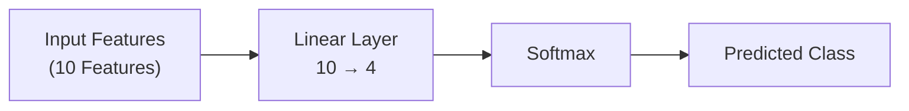
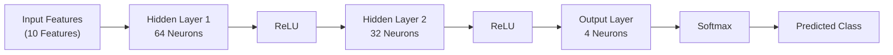
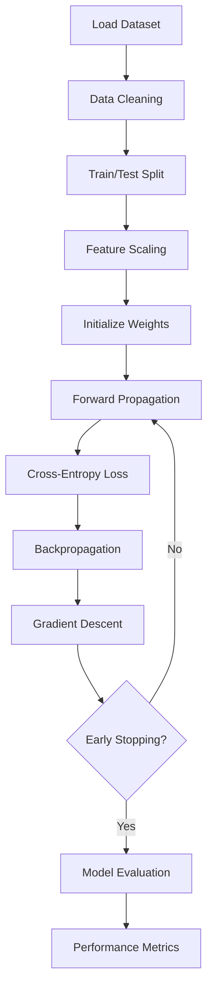
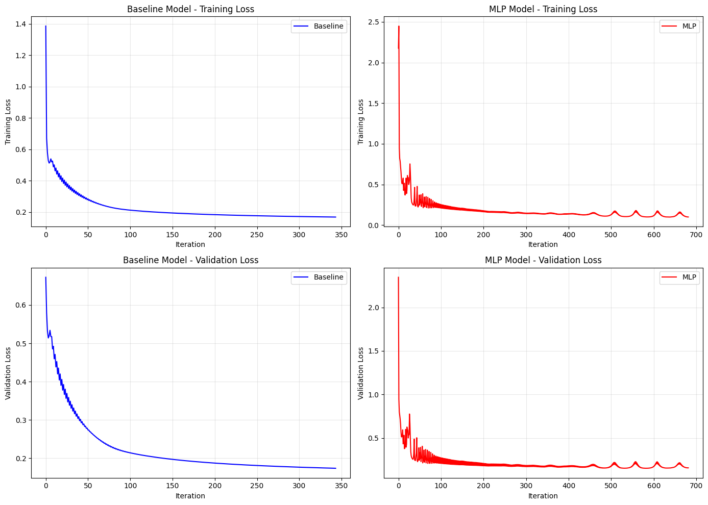
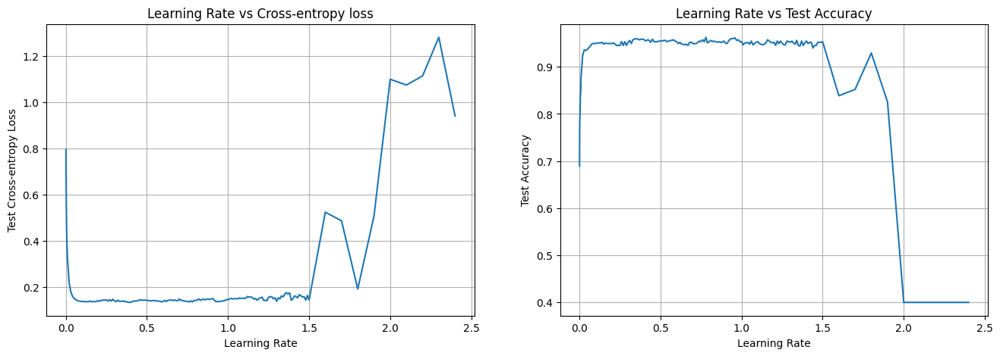
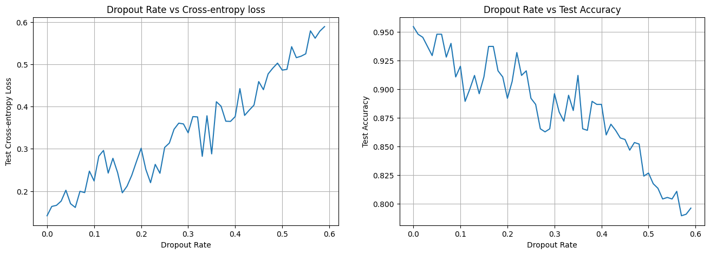
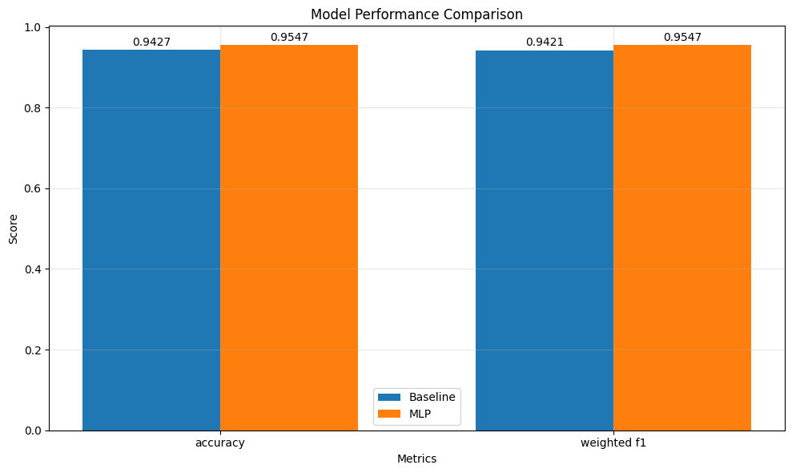
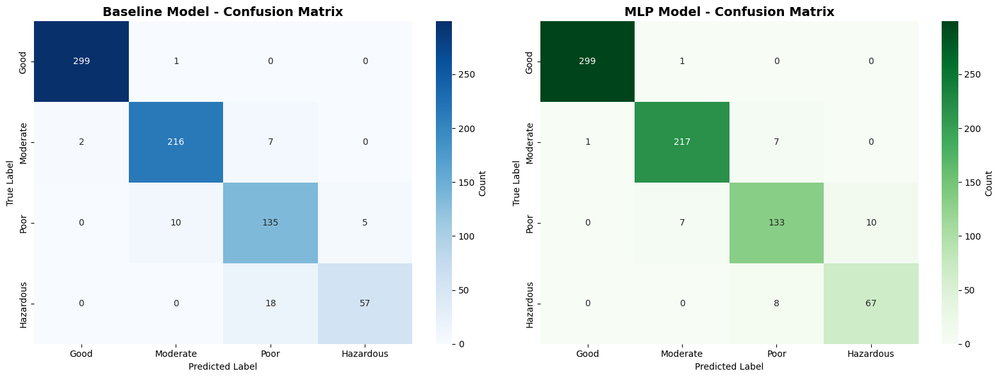
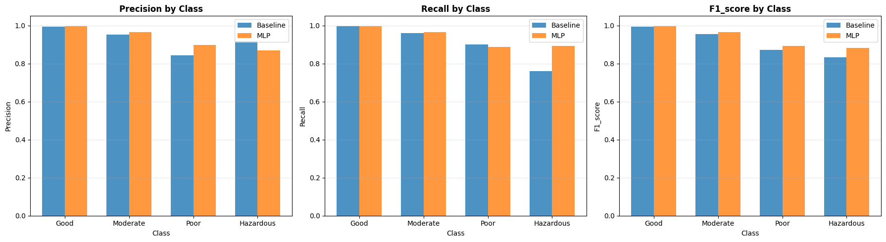

# Multi-Layer Perceptron (MLP) from Scratch

A complete implementation of a **Multi-Layer Perceptron (MLP)** using **NumPy** to classify air quality levels. This project demonstrates the internal workings of neural networks by implementing forward propagation, backpropagation, gradient descent, and early stopping without relying on deep learning frameworks such as TensorFlow or PyTorch.

---

## Project Overview

This project focuses on building a feedforward neural network completely from scratch and comparing its performance against a simple linear classifier.

The implementation includes:

- Data preprocessing and normalization
- Weight and bias initialization
- Forward propagation
- ReLU activation
- Softmax output layer
- Cross-Entropy loss
- Backpropagation
- Gradient Descent optimization
- Early stopping
- Model evaluation and visualization

---

## Dataset

**Air Quality and Pollution Assessment Dataset**

The dataset contains environmental and demographic features used to classify air quality into four categories.

### Features

- Temperature
- Humidity
- PM2.5
- PM10
- NO₂
- SO₂
- CO
- Population Density
- Industrial Proximity
- Other environmental attributes

### Target Classes

- Good
- Moderate
- Poor
- Hazardous

---

# Model Architectures

## Baseline: Linear Classifier

A simple linear model is used as a baseline for comparison.



The linear classifier computes

\[
\hat{y}=Softmax(Wx+b)
\]

---

## Proposed Model: Multi-Layer Perceptron

The MLP extends the baseline by introducing hidden layers with non-linear activation functions, enabling the model to learn complex decision boundaries.



> **Note:** Update the hidden layer sizes if your implementation uses different neuron counts.

---

# Training Pipeline



---

# Model Comparison

| Feature | Linear Classifier | Multi-Layer Perceptron |
|----------|------------------|------------------------|
| Architecture | Single Linear Layer | Multiple Hidden Layers |
| Activation | Softmax | ReLU + Softmax |
| Decision Boundary | Linear | Non-linear |
| Learning Capacity | Limited | High |
| Performance | Baseline | Improved Classification Accuracy |

---

# Technologies Used

- Python
- NumPy
- Pandas
- Matplotlib
- Scikit-learn
- Jupyter Notebook

---

# Repository Structure

```
mlp-from-scratch/
│
├── README.md
├── requirements.txt
├── LICENSE
├── mlp_from_scratch.ipynb
│
└── images/
    ├── training_and_vaidation_loss.png
    ├── learning_rate_analysis.png
    ├── dropout_analysis.png
    ├── confusion_matrix.png
    ├── classwise_performance.png
    └── performance_comparison.png
```

---

# Results & Visualizations

The following visualizations summarize the training process, hyperparameter analysis, and model performance.

---

## 1. Training and Validation Loss Curve

Shows the convergence of the MLP and baseline model during training and validation.



---

## 2. Learning Rate Analysis

Performance comparison using different learning rates.



---

## 3. Dropout Analysis

Effect of dropout regularization on model performance.



---

## 4. Overall Performance Comparison

Comparison between the baseline linear classifier and the proposed MLP model.



---

## 5. Confusion Matrices

Confusion matrices for the evaluated models.



---

## 6. Class-wise Performance Metrics

Precision, Recall and F1-score comparison across all classes.



---

# Learning Outcomes

This project provides hands-on experience with the fundamental concepts behind neural networks, including:

- Matrix-based forward propagation
- Backpropagation using the chain rule
- Gradient descent optimization
- Multi-class classification
- Early stopping
- Neural network training dynamics
- Performance evaluation and visualization

---